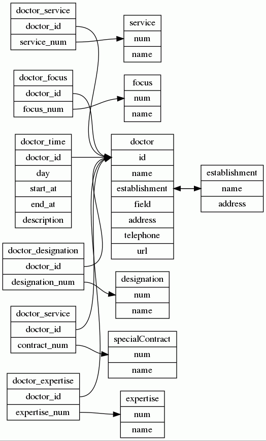

# KVT-Arztliste Scraper

## About & Motivation

The "Kassenärztliche Vereinigung Thüringen" (Association of Statutory Health Insurance Physicians Thuringia) provides a central form to search for doctors in Thuringia.
You can filter by profession, additional services and so on. Which is **great**.
But the interface has certain limitations. For example, you can not serach for multiple professions, focuses or range of services.
Which frankly isn't great if you, well, need to filter for multiple of these.
Further more, there is no way to get the doctors in a machine readable form.
If that would be the case, it would be easy to generate an spreadsheet of doctors you need to call and when you can call them (especial with Psychotherapists thats not a trivial task).

Bothered by this ourself, we decided to make to make the huge pile of data they are sitting on and making it a bit more open.
Mainly to ease access to care.

This project aims to extract doctors from the serach interface provided by the "Kassenärztliche Vereinigung Thüringen" and provide them in a machine readable format to help those in need to find the doctors they need.

## Structure

This section explains the different types of data thats being extract from the original serach form, how it is processed and where it is stored.

### Options

There are numerous options availabel to filter. Their names in the form are not very intuitive, so this section aims to explain them a bit more.

All of these parameters are in the form with the following name: `tx_t3kvclient_showclient[type<name>]`. So the selection for `Leistungsangebote` (Range of services) has the name `Genehmigung` which translates to `tx_t3kvclient_showclient[typeGenehmigung]` as the form input name. All of the availale options with their labels and a short explanation are listed in the following table:

name | label | name translated | description
--- | --- | --- | ---
Fachgebiet | Fachgebiet | Field of expertise | The overal field of a doctors expertise. E.g. `FA Chirurgie` (Specialisz surgeon) or `Psychotherapeutisch tätiger Artzt` (Psychotherapeutically active doctor)
Schwerpunkt | Schwerpunkt | Focus | The more narrow focus of a doctor. E.g. `SP Unfallchirurgie` (Trauma Surgery)
Zusatzbezeichnung | Zusatzbezeichnung | Additional designation | Any additional designations a doctor may have. E.g. `Sportmedizin` (Sports Medicine) or `Röntgendiagnostik - fachgebunden Skelett` (X-ray diagnostics - bound to the skeleton)
Genehmigung | Leistungsangebote | Range of Services | Special treatments or diagnostics offered by the doctor. E.g. `Zweitmeinungsverfahren für Mandeloperationen (Tonsillektomie, Tonsillotomie)  (gem. § 7 i.V.m. Bes. Teil Eingriff 1 der Richtl. z. Zweitmeinungsverfahren)` (Second opinion procedure for tonsillectomy (tonsillectomy, tonsillotomy) (according to § 7 in connection with Part 1 of the guidelines for second opinion procedure)) or `Tiefenpsychologisch fundierte Psychotherapie für Erwachsene` (Depth psychologically based psychotherapy for adults)
Selektivvertraege | Sonderverträge | Special contracts | Since we're still in capitalism so is our Health care system some insurance providers may offer some special services if you are ensured with them or have special deals with doctors. E.g. `Hautkrebsvorsorge-Verfahren TK` (Skin cancer screening procedure TK [TK is the German "Techniker Krankenkasse"]) or `Osteoporose AOK PLUS` (Osteoporosis AOK PLUS)

They are represented like this in the original HTML Code:

```html
<label class="drittel" style="display: inline-block;">
	<span>Sonderverträge</span>
	<select id="selSelektivvertraege" name="tx_t3kvclient_showclient[typeSelektivvertraege]">
		<option value="">Bitte wählen</option>
		<option value="358">Amblyopie-Screening (KNAPPSCHAFT)</option>
		<option value="[...]">[...]</option>
		<option value="234">Zus. Kinderuntersuch. TK</option>
	</select>
</label>
```

As you can See, every entry as a number, passed via the `value` parameter. These numbers seem(!) to be unique across all option categories. When extracted using the `get_options.py` script, all of the options are wirtten as a CSV to `out/sel<name>.csv`. Every CSV contains two columns. `num` and `name`. `num` represents the `number` from the `select` item and `name` the options name. The CSV for the available focuses, for example, contains these values (only a selection):

num | name
--- | ---
9   | SP Rheumatologie
14  | SP Gastroenterologie
16  | SP Pneumologie
22  | SP Unfallchirurgie

### Doctors

The main Objects of interest are the doctors. The most basic representation of a doctor (in JSON) looks like this:

```json
{
  "url": "https://www.kv-thueringen.de/arztsuche/arztsuche-details?tx_t3kvclient_showclient%5Baction%5D=show&tx_t3kvclient_showclient%5Bclient%5D=09d713ec&tx_t3kvclient_showclient%5Bcontroller%5D=Client&tx_t3kvclient_showclient%5Bplace%5D=9e15a075&cHash=dda4f561a91f16c2027a22869c6ed87d",
  "field": "FA Anästhesiologie",
  "establishment": "Herrn Doc Maier",
  "name": "Doc Maier",
  "address": "13373 Ilmenau, Oberer Schlossweg 13"
}
```

while a doctor with all values filled out can look like this:

```json
{
  "serviceRange": [
    "Allgemeine Röntgendiagnostik",
    "Physikalisch-medizinische Leistungen",
    "Schlafbezogene Atmungsstörung/kardiorespirator. Polygraphie § Satz 1/B d. QSV  gem. § Abs.2 SGB V",
    "Schlafbezogene Atmungsstörung/kardiorespirator. Polysomnographie § Satz 1/C d.QSV  gem. § Abs.2 SGB V",
    "Sono: 03.2 Gesichts- und Halsweichteile (einschl. Speicheldrüse)",
    "Sono: 03.3 Schilddrüse",
    "Sono: 05.1 Thorax (ohne Herz) - transkutan",
    "Sono: 07.1 Abdomen ... - transkutan, B-Mode (J/E)",
    "Sono: 08.1 Urogenitalorgane - transkutan",
    "Videosprechstunde"
  ],
  "name": "Dr. med. Ulrika Maier",
  "otherDocs": "Dr. med. Some Other Doc",
  "additionalDesignation": [
    "Notfallmedizin",
    "Schlafmedizin"
  ],
  "url": "https://www.kv-thueringen.de/arztsuche/arztsuche-details?tx_t3kvclient_showclient%5Baction%5D=show&tx_t3kvclient_showclient%5Bclient%5D=7b9e0c44&tx_t3kvclient_showclient%5Bcontroller%5D=Client&tx_t3kvclient_showclient%5Bplace%5D=eec9b013&cHash=1f62282890a6fcff17b2840fe9c51515",
  "focus": [
    "SP Pneumologie"
  ],
  "telephone": "03681-13371312",
  "field": "FA Innere Medizin",
  "specialContracts": [
    "DMP Asthma bronchiale",
    "DMP COPD Chronische Atemwegserkrankung"
  ],
  "address": "98527 Suhl, Friedrich-König-Str. 14",
  "establishment": "Gemeinschaftspraxis Dr. med. Ulrika Maier, MHBA und Kolleg:innen"
}
```

### Database Structure

Using the script `import_docs.py` all doctors from `out/doctors.json` are getting imported to a PostgreSQL database. The database structure looks roughly like this (source: `datastruct.dot` using GraphViz):



The SQL Code for the database strucutre lives in `database.sql`.

## What's next

### WebGUI

We are planning to create a WebGUI to offer the features we feel that are missing.
These range from filtering for multiple options in one category to exporting the results of your query as a spreadsheet or something else.

### Your project

There are numerous cool projects. For example, you could create an application that generates lists with times when you can call doctors.
This is just one example, we are sure there are many project ideas that can help everyone!

## Team

- clerie
- e1mo
